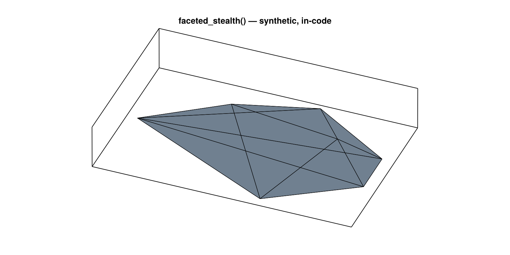
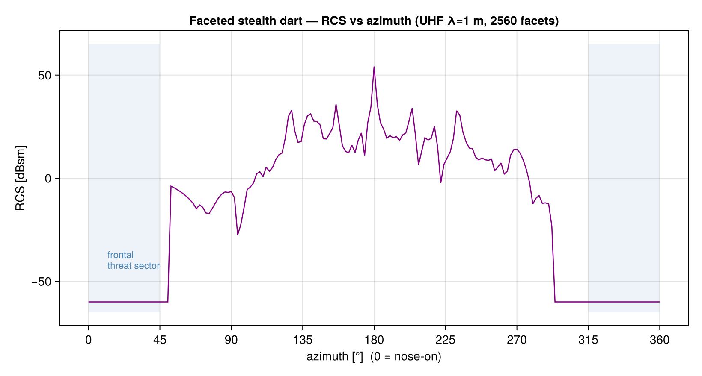

# Stealth shaping: a faceted case study

The defining idea of first-generation stealth (the F-117) is **shaping**: build the aircraft from
flat facets, each angled so that the mirror-like specular flash bounces *away* from where the radar
is — straight ahead. This page demonstrates that with a shape we can actually ship: a synthetic,
all-flat-facet body defined entirely in code, so there are no model licences or restrictions
attached. It is **not** the real F-117 geometry — it is a stylised stand-in that obeys the same
physics.

## The shape

[`faceted_stealth`](@ref) returns a closed, watertight body: a flat belly, a ridged faceted top,
and swept wings — 7 vertices, 10 facets, every edge shared by exactly two faces.

```@example stealth
using LowObservables

m = faceted_stealth()                       # length=20 m, span=13 m by default
shared = [length(v) for v in values(m.edge_faces)]
println("facets: ", nfaces(m), "   watertight: ", all(==(2), shared),
        "   (Euler V−E+F = ", nvertices(m) - length(m.edge_faces) + nfaces(m), ")")
nothing # hide
```



Because it is just geometry, you can refine it for finer facets (`refine`) and scale it
(`faceted_stealth(length=…, span=…, height=…)`).

## Its radar signature

We sweep the monostatic RCS around the aircraft in the horizontal plane and watch what the faceting
does. (At VHF/UHF the facets must be ≲ the wavelength for Physical Optics to be valid, so we refine
to ~2,500 facets and use λ = 1 m — see [Physical Optics](physical-optics.md).)

```julia
mr = m; for _ in 1:4; mr = refine(mr); end          # ~2560 facets (≈ 0.5 m, valid at λ=1 m)
λ = 1.0; k = 2π/λ
ϕs = range(0, 2π; length = 181); ei = [0.0, 1.0, 0.0]
σ  = [ptd_rcs_monostatic(mr, [sin(ϕ),0,cos(ϕ)], ei; k=k) for ϕ in ϕs]
```



| sector | mean RCS |
|--------|----------|
| **frontal (±45° of nose-on)** | **−60 dBsm** (the numerical floor — *essentially zero*) |
| broadside | −6 dBsm |
| worst-angle flash (tail-on) | +54 dBsm |

## What this shows

- **The frontal threat sector is invisible.** Across ±45° of nose-on (shaded), *no facet is
  perpendicular to the radar*, so PO deflects every return off-axis — the RCS drops to the floor.
  The frontal sector is **~54 dB (≈250,000×) quieter than broadside.** That asymmetry is the entire
  point of stealth shaping: be dark where the threat is.
- **The energy doesn't disappear — it's redirected.** The sides and rear are *bright*, with sharp
  flashes where a facet does line up with the radar. This is the optical-theorem law
  ``σ_\text{tot}=2A`` made visual (see [Physical Optics](physical-optics.md)): a large object always
  scatters; shaping only steers the backscatter away from the threat, it cannot remove it. Real
  stealth aircraft accept bright side/rear lobes to win the frontal sector.
- **It generalises.** The [shape-optimisation](optimization.md) capstone discovers this same
  principle automatically — given an RCS objective and a size constraint, the optimiser tilts and
  facets surfaces to deflect the specular, exactly as a designer would.

## Caveats

The absolute numbers are honest only as a *demonstration*: PO at this facet size is approximate,
and a faceted body at VHF is in the resonance regime. Treat the **frontal-vs-side contrast and the
shaping mechanism** as the result, not the precise dBsm. For why we use this synthetic shape rather
than a downloaded F-117 model, see the note on model licensing in the project history — in short,
in-code geometry is reproducible and unencumbered.
